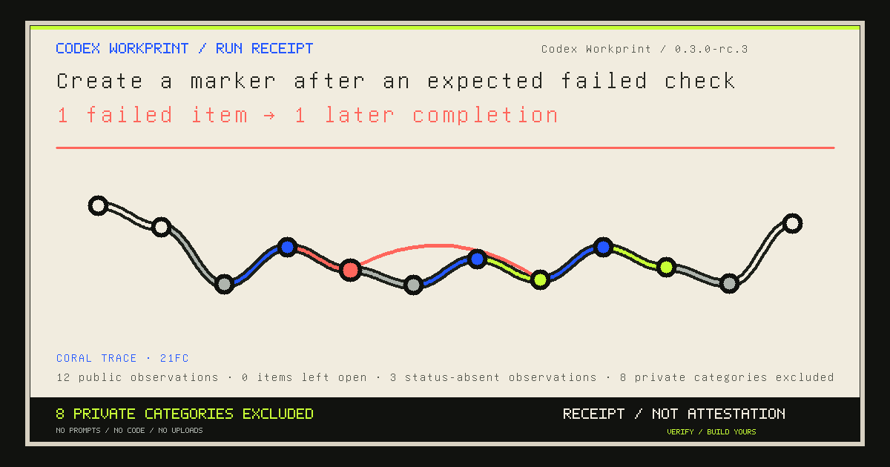
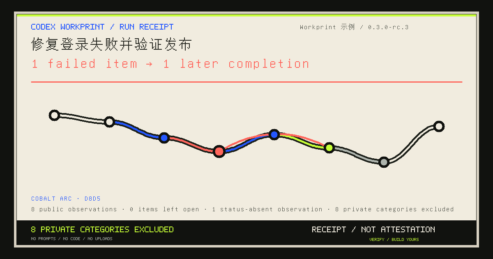
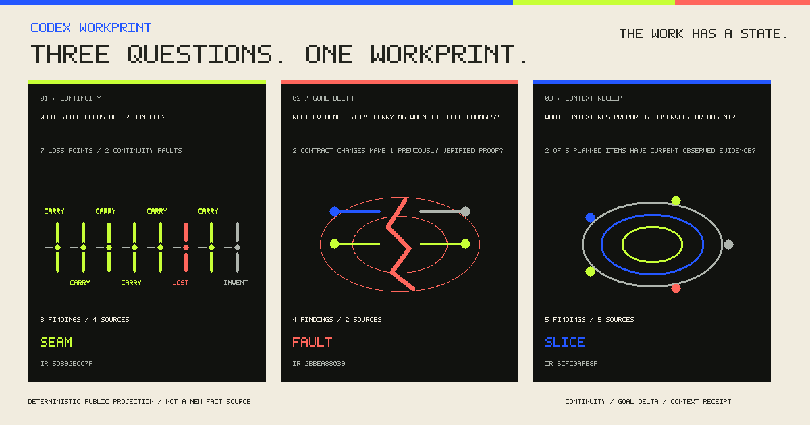
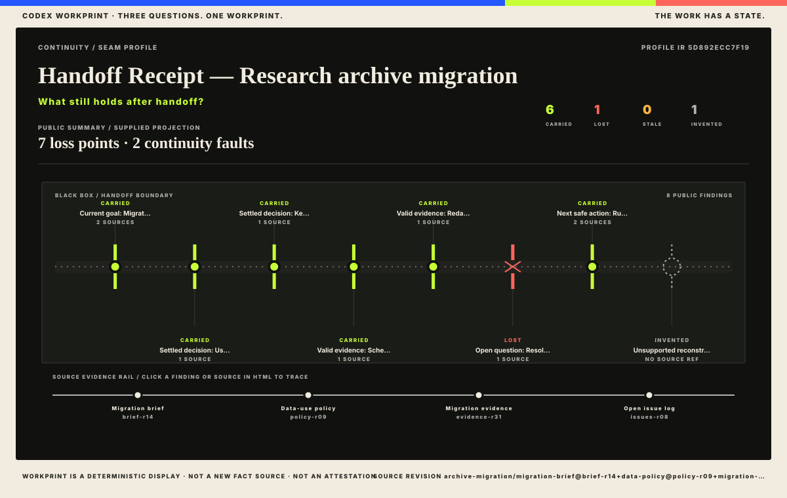
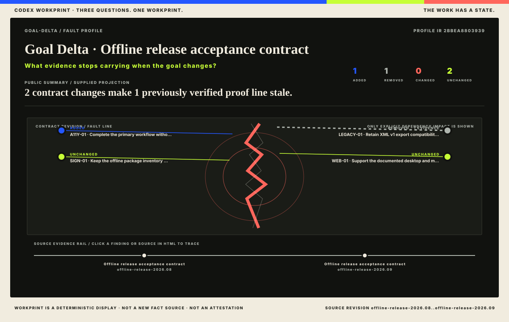

# Codex Workprint

**Every agent run leaves a Workprint.**

Turn a Codex run into a privacy-safe, verifiable visual receipt. **No prompts. No code. No uploads.** Workprint publishes a fixed observation trace and a distinctive work fingerprint while keeping transcript content, commands, output, paths, usage, and implicit identity out by default.

<p align="center">
  <a href="demo/workprint.html"></a>
</p>

```powershell
codex exec --json "<your task>" | node ./bin/codex-workprint.js build - --title "Ship the release" --out ./workprint --open
```

The terminal returns `WORKPRINT READY`, the public observation count, the number of excluded private categories, the Story and share-card paths, and the exact verify command. The same seven-file bundle is still deterministic and tamper-evident.

> A Workprint is a **receipt of observed public metadata**, not proof that the source was authentic, the task was correct, or a failure was recovered.

## Try the packaged example offline

Download the **[portable ZIP from the GitHub prerelease](https://github.com/codex-improvement-lab/codex-workprint/releases/tag/v0.3.0-rc.3)**, extract it, and open a terminal in its `codex-workprint-0.3.0-rc.3` folder. Node.js 22.18.0 or newer is enough; no Codex account or model call is needed for this explicitly synthetic example:

```text
node ./bin/codex-workprint.js build ./examples/first-run/input.jsonl --title "Synthetic first run" --out ./first-workprint
node ./bin/codex-workprint.js verify ./first-workprint
```

Open `first-workprint/workprint.html`, or add `--open` to the build command. The release also provides an installable tarball and SHA-256 sidecars; see the [distribution record](release/README.md). This project is not published to npm.

## Run Receipt — the first product

The share card carries one large bounded conclusion, one unique Workprint Glyph, a memorable deterministic shape name, and a privacy mark. The self-contained Story adds Share, Download card, Copy caption, Copy verify command, station replay, and a visual Privacy Receipt without making a network request.

<p align="center">
  <a href="demo/workprint.html"></a>
</p>

The example is not a mockup. It was recompiled from a retained, no-secret Windows Codex CLI 0.145.0 run. Its raw JSONL remains local and ignored. Optional `--project`, `--by`, `--release`, `--public-url`, and `--lang` values are public only when explicitly supplied, are listed in the privacy receipt, and never change the underlying Shape ID.

### Unicode is a share-surface contract

<p align="center">
  <a href="examples/unicode-run-receipt/workprint/workprint.html"></a>
</p>

The title above is rasterized from the pinned local Unifont 17.0.05 bitmap source—not a system font and not question-mark substitution. Title, headline, detail, identity, shape name, and public URL all fail closed before rasterization if a glyph is missing. The direct regression covers `修复登录失败并验证发布` and every fixed headline branch. This is deterministic basic CJK title support, not UI localization, BiDi/shaping support, emoji coverage, or complete Unicode support.

> **The Run Has a Shape.** The Workline combines a working print, transit line, and fingerprint. Blue means explicit started/in-progress; acid green means explicit completed; coral means explicit failed/nonzero or a later-completion relation; silver means unknown or status not observed.

## A Run Sheet, not a widget

The first versions proved that a run could have a stable visual fingerprint. rc.3 makes that fingerprint a full reading surface:

- the full-width serpentine Workline preserves every ordered observation and folds long runs instead of shrinking them away;
- quiet stitches connect a pseudonymized `item.started` observation to its later `item.completed` observation, while an unmatched start remains visibly open;
- turn brackets, up to three bounded turning points, and a sequence-only rhythm strip add hierarchy without reading private content or inventing time;
- Replay advances station by station and updates the public observation detail; reduced-motion users get the complete shape without animation;
- narrow screens receive a native vertical route rather than a miniature desktop poster.

These layers are deterministic render-time views of the public IR. They add structure, not new source access or stronger truth claims.

## Two real runs. Two different shapes.

<div style="display:grid;grid-template-columns:repeat(auto-fit,minmax(min(100%,28rem),1fr));gap:1rem;align-items:start">
  <a href="demo/workprint.html"></a>
  <a href="examples/alternate-workprint/workprint.html"></a>
</div>

These are two retained, small, no-secret Codex CLI 0.145.0 inputs captured on Windows and rebuilt for this version. Their JSONL event records were not hand-edited before compilation; only the public titles, labels, and annotations were explicitly reviewed. The comparison demonstrates different public observation structures and different Shape IDs. It does not prove the sources authentic, the tasks correct, or either run attributable to an identity.

## The 90-second first Workprint

Requirements: Node.js 22.18.0 or newer. There are no runtime dependencies, accounts, uploads, remote assets, or telemetry.

```powershell
codex exec --json "<your small task>" | node ./bin/codex-workprint.js build - `
  --title "Ship the release" `
  --project "Public project" `
  --release "v1.4" `
  --out ./workprint `
  --open
```

`--project`, `--by`, `--release`, `--public-url`, and `--lang` are optional public identity fields. Omit them to publish no identity. Use `--public-url` only after a stable query-free HTTPS page exists; credentials, query strings, and fragments are rejected because the URL enters public IR, captions, canonical metadata, and Open Graph metadata. This option never uploads or fetches anything.

For the auditable path, save the JSONL and run `inspect`, `build`, then `verify`. UTF-8 BOM/no-BOM and LF/CRLF remain covered by adapter tests.

Installing the release tarball exposes the same three actions through the `codex-workprint` package command. The npm name has not been reserved or published.

`inspect` is the privacy preview. It lists the fixed whitelist, excluded field categories and counts, ordered public observations, visible unknowns, explicit public fields, and the claim ceiling before any bundle is written.

`build` writes exactly:

```text
workprint/
├── workprint.html
├── workprint.svg
├── share-card.png
├── embed.md
├── workprint.json
├── privacy-receipt.json
└── MANIFEST.sha256
```

`verify` validates the current Run IR 0.2 digest and derived summary, regenerates every public artifact, compares bytes, checks the manifest, and rejects missing, changed, symlinked, or unexpected entries. Historical Run IR 0.1 has a byte-frozen schema and requires its matching historical CLI; rc.2 refuses it explicitly rather than silently changing its meaning.

Profile bundles are deliberately a different seven-file type:

```text
profile-workprint/
├── workprint-profile.html
├── workprint-profile.svg
├── share-card.png
├── embed.md
├── workprint-profile.json
├── profile-receipt.json
└── MANIFEST.sha256
```

Run `verify` never accepts that bundle, and `profile verify` never accepts the legacy Run bundle.

## Three questions. One Workprint.

**The work has a state.** Profiles compile three narrow public projections without becoming a new fact source.

Profiles are the second product layer for already-public work state—not the first-run acquisition path.

<p align="center">
  
</p>

| Handoff Receipt | Change Impact Receipt | Context Receipt |
| --- | --- | --- |
| **What still holds after handoff?** | **What evidence stops carrying when the goal changes?** | **What context was prepared, observed, or absent?** |
| continuity / seam | goal delta / fault | context / slice |
| [](examples/profile/continuity-archive-migration/workprint/workprint-profile.html) | [](examples/profile/goal-delta-offline-release/workprint/workprint-profile.html) | [](examples/profile/context-receipt-observation-gap/workprint/workprint-profile.html) |

The inputs are self-contained synthetic-scenario public projections from three Lab incubators. Workprint compiles them; it does not establish their authenticity or correctness. The exchange contract remains `workprint-profile/0.1` with exactly `continuity`, `goal-delta`, and `context-receipt`. Read the [Profile IR and bundle contract](docs/PROFILE_IR.md).

```powershell
node ./bin/codex-workprint.js profile inspect ./examples/profile/continuity-archive-migration/profile.json
node ./bin/codex-workprint.js profile build ./examples/profile/continuity-archive-migration/profile.json --out ./profile-workprint
node ./bin/codex-workprint.js profile verify ./profile-workprint
```

## What the first screen actually says

In ten seconds, the artifact answers:

- what public title the user selected;
- which event/item types were observed and in what order;
- how many item observations were started, explicitly completed, failed, unknown, or missing status;
- whether an explicit failed item was followed by another explicit completed item;
- which started/completed records share a pseudonymized item association, where a turn begins/ends, and which bounded public turning points deserve attention;
- how to generate a Workprint from another run.

It does **not** claim the task recovered, passed validation, completed correctly, came from an authentic source, or belongs to a named author. `turn.completed` is rendered only as a turn-completion observation.

## Observations first; phases only by explicit annotation

Codex CLI 0.145.0 was directly observed on Windows emitting `thread.started`, `turn.started`, `item.started`, `item.completed`, and `turn.completed`, with `command_execution`, `file_change`, and `agent_message` item types in the two build runs. The adapter retains only fixed event/item enums, pseudonymized item association, explicit `status`, and integer `exit_code`.

It never reads a command body to guess `inspect`, `edit`, `verify`, `recover`, or `deliver`. If you want a reviewed public phase, add it explicitly after `inspect`:

```powershell
node ./bin/codex-workprint.js build run.jsonl `
  --title "Public release run" `
  --annotate "5:verify:Expected public check" `
  --annotate "7:edit:Reviewed file change" `
  --out ./workprint
```

Annotations are optional public labels. Their exact IR paths are listed in `privacy-receipt.json`.

## Shape identity is separate from public copy

`source.shapeSha256` names only the ordered public observation structure: event type, pseudonymized item association, item type, explicit status/exit code, and the observed post-failure relation. Title, run labels, phase labels, and annotation text are excluded.

That means the same event stream keeps the same Shape ID and point/line geometry even when reviewed public copy changes; the complete `publicIrSha256` still changes to bind that copy. Different event streams must have different shape identities. The short Shape ID printed in HTML, SVG, and PNG is a reproducible handle, not authenticity, correctness, or authorship evidence.

## Default-deny projection

| Public by default | Excluded by default |
| --- | --- |
| fixed event/item category and sequence | prompt, reply text, and reasoning |
| pseudonymized item association | command text, arguments, stdout/stderr, and tool response |
| explicit status and integer exit code | file content, diffs, absolute paths, environment, and host data |
| visible unknown/not-observed node | `thread_id`, usage/token counts, model, account, organization, and identity |
| explicit public title, labels, annotations | raw JSONL values and raw-input digest |
| shape/public IR and output hashes | anything not on the adapter whitelist |

The privacy receipt is an auditable record of the projection, not a no-leak guarantee. Review [the complete privacy model](PRIVACY.md) and [security policy](SECURITY.md) before publishing an artifact.

## Stable layers, narrow scope

```text
user-supplied Codex JSONL (upstream fields may evolve)
                       │
             adapter 0.2.0 whitelist
                       │
          Workprint IR v0.2 public projection
                       │
       deterministic HTML · SVG · PNG · receipts

supplied workprint-profile/0.1 public projection
                       │
             explicit profile whitelist
                       │
          Profile IR workprint-profile-ir/0.1
                       │
      seam · fault · slice HTML/SVG/PNG · receipts
```

The current [IR schema](schema/workprint-ir-v0.2.schema.json) and [adapter notes](docs/WORKPRINT_IR.md) keep upstream JSONL evolution separate from the public contract; the historical 0.1 schema remains byte-frozen. Unknown envelopes, unknown item types, malformed lines, missing `type`, and missing item `id/type` become visible `unknown` observations with no raw payload.

Workprint is deliberately not a transcript viewer, generic architecture diagram, live dashboard, agent scorer, hosted gallery, multi-agent platform, or authenticity service. It does not read Codex Desktop internal rollout files.

## Deterministic PNG without a browser

`share-card.png` is drawn by `workprint-png-v5/indexed-stored-deflate/unifont-17.0.05`: a fixed 1200×630 indexed rasterizer with a large signature sentence, deterministic Workprint Glyph, privacy mark, self-written PNG chunks, and a pinned local GNU Unifont bitmap source for covered BMP text including CJK. It does not use a system font, Canvas, browser build, native image library, runtime dependency, or platform compression choice. Missing public glyphs fail the build; localization, complex-script shaping, supplementary-plane, and emoji coverage are not claimed.

## Develop and verify

Source checkouts run TypeScript outside `node_modules`. Distributions ship generated JavaScript under `dist/`, built automatically by `prepack`; Node refuses native type stripping inside installed dependencies. The installed-layout regression compares Run and all three Profile outputs byte-for-byte with source outputs. The development-only compiler uses the recorded Node version; release archive byte identity is not claimed across different compiler versions.


```powershell
node --test
node ./scripts/release-check.mjs
node ./scripts/build-demo.mjs
node ./scripts/build-unicode-example.mjs
node ./scripts/build-profile-examples.mjs
```

The suite covers the Node preflight, bounded stdin and `--open`, strict opt-in public identity, query-free public URLs, immutable IR 0.1 plus current IR 0.2, shell-injection payloads against Build yours, fixed-template story branches, separate open/status-absent semantics, observed CLI 0.145.0 shapes, copy-independent Shape IDs/geometry, preserved started/completed history, long-run folding, Run Sheet associations/turn ranges/turning points, file-change content exclusion, explicit-only phases, UTF-8 BOM plus LF/CRLF equivalence, malformed and unknown records, privacy attacks, HTML/SVG escaping, local share/copy/download hooks, visible clipboard fallback, station-by-station Replay/reduced-motion hooks, fail-closed public-text glyph coverage, indexed PNG identity/byte ceiling, double-build determinism, exact bundle verification, and tamper/unexpected-file rejection.

The release gate runs `windows-latest` and `macos-latest` on Node 22.x and 24.x; see each commit's [GitHub Actions result](https://github.com/codex-improvement-lab/codex-workprint/actions). A hosted macOS job is distinct from physical-Mac evidence; the [real-Mac handoff](docs/MACOS_HANDOFF.md) records that separate process.

## Contributing and support

Read [CONTRIBUTING.md](CONTRIBUTING.md) before proposing a change. Use [SUPPORT.md](SUPPORT.md) to choose between Discussions, the structured issue forms, and the private vulnerability route in [SECURITY.md](SECURITY.md). Never post raw real-run JSONL or excluded values in an issue or pull request.

## Evidence status

- **Run Receipts observed locally on Windows:** two retained no-secret real-input public projections plus one Chinese synthetic example; all three deterministic 7-file Run IR 0.2 bundles verify; the primary social preview/share card is an indexed 756798-byte 1200×630 PNG.
- **Current Run Receipt browser evidence:** primary and Chinese HTML at requested 1440×900 and 390×844, plus a 1280×720 button-layout regression; 7 current screenshots including desktop/narrow copy fallback; Share/Copy verify/Download/Replay/trace paths; 0 overflow/outliers, console warnings/errors, remote assets, missing share-card public glyph fields, and Unicode replacement characters. See the [Run Receipt browser receipt](docs/evidence/browser/run-receipt-qa-receipt-2026-09-05-0.3.0-rc.3.json).
- **Unified Profiles observed locally on Windows:** three self-contained synthetic-scenario public inputs; three deterministic 7-file bundles; strict Profile/Run isolation; deterministic 756798-byte triptych. Their six-view 0.2 browser receipt remains artifact-bound historical evidence.
- **Physical-Mac evidence:** the exact 0.3.0-rc.2 baseline has a scoped externally supplied PASS with maintainer-accepted screenshot correspondence. That acceptance remains intact. The current rc.3 changes action-label wrapping, ships compiled JavaScript for installed packages, and adds a synthetic offline input; this presentation delta has current Windows browser evidence, not a new physical-Mac run. See [platform scope](docs/PLATFORM_SUPPORT.md).
- **Hosted automation:** the four Windows/macOS × Node 22/24 jobs must pass on the source commit before tagging. The [Actions page](https://github.com/codex-improvement-lab/codex-workprint/actions) carries the observed results.
- **Local distribution:** a pnpm tarball and portable ZIP were built and exercised offline, including the package bin shim, stdin/file inputs and all three Profiles. Public registry publication is separate.
- **Not established by this release:** new rc.3 physical-Mac acceptance, independent-user comprehension, reuse, sharing, adoption, or market demand.

The project is at `0.3.0-rc.3`. Source and prerelease archives are distributed through [codex-improvement-lab/codex-workprint](https://github.com/codex-improvement-lab/codex-workprint). The historical Run/Profile evidence and rc.2 Mac acceptance remain intact. npm and plugin-directory publication are separate from this GitHub release.

Read the [release checklist](RELEASE_CHECKLIST.md), [GitHub publication runbook](GITHUB_RELEASE.md), [release notes](RELEASE_NOTES.md), [platform boundary](docs/PLATFORM_SUPPORT.md), and [changelog](CHANGELOG.md).

## License

MIT © 2026 Codex Workprint contributors. No affiliation with or endorsement by OpenAI is implied.
