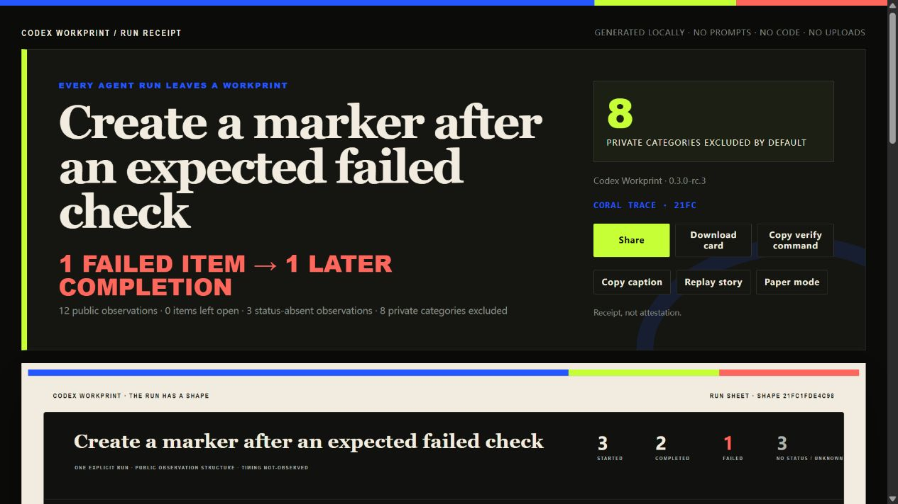

# Workprint：功能、视觉与增长机会

日期：2026-09-05。范围是当前 Workprint `0.3.0-rc.3`，并给出对 Lab 的共通启发。本文是负责人基于实际界面、源码、发行实测与公开产品材料的判断，没有开展真实用户评分或增长实验。

## 判断

**有明显的提升机会。最值得做的是：让陌生人迅速看懂这份工作有什么值得看、在第一屏认出独有的 Workprint 图形，并顺手完成“验证它→生成自己的”流程。**

这能较有把握地改善产品评价与上手体验；关注度能否大幅增加，还取决于传播入口、选用案例和外部反馈，不能从漂亮截图推算 Star 或采用率。

本轮已经补齐两项评价基础：1280px 的按钮文字溢出，以及安装到 node_modules 后不能加载 TypeScript 的发行缺陷。它们属于实际可用性，不应被更多动画掩盖。新包也附了不需要账号/模型调用的合成输入，降低第一次尝试的成本。

## 1. 当前真正有价值的部分

| 能力 | 当前价值 | 需要保留的边界 |
| --- | --- | --- |
| Run Receipt | 把运行观察变成可携带、可核验的作品 | 当前图形表示顺序和结构，不是耗时、效率或任务正确性 |
| Shape ID 与确定性输出 | 同一公共输入可重建，图形具有识别度 | 哈希不证明来源真实性或作者身份 |
| 默认私密内容排除 | 用户可以保留工作结构而不公开正文 | 安全边界应可解释，但不必占据首屏最多空间 |
| 三类 Profiles | Continuity / Goal Delta / Context Receipt 让 Workprint 超过单条运行曲线 | 结果来自明确来源，渲染器不重新推断事实 |
| 单文件 HTML、SVG、PNG | 可以进入 README、Release、讨论与交接 | 本地文件还缺少流畅的接收者验证和再次生成入口 |

这里最强的组合是“有来源的工作状态＋能分享的视觉表达”。继续扩大为通用 Agent 仪表盘，会增加理解和维护成本。

## 2. 实际界面的优点与问题

当前 HTML 使用大衬线标题、黑/米白底色，以及蓝、酸绿、珊瑚红，具有编辑式技术出版物的辨识度。Run、seam、fault、slice 的图形语言值得保留。它已经具备自己的视觉方向，无需重做成通用渐变或玻璃卡片。

但存在五个影响第一印象的问题：

1. **示例主题太像内部测试。** 当前主案例是创建一个标记并观察失败后的完成。它能说明技术边界，但陌生人难以立刻理解为什么值得分享。后续应选一个明确授权、可以公开描述的实际开发任务；必须从真正捕获的输入生成，不能把本轮对话手工改造成“真实 exec JSONL”。
2. **首屏的视觉重心偏向排除数量。** 最大的数字是“8 类私密内容被排除”，而工作本身的意义与独特图形较晚出现。建议让工作主题和图形成为主角，隐私说明进入较小的信任条与可展开详情。
3. **移动首屏几乎没有真正的指纹。** 本次主案例在 390×844 下，核心纵向线路起点约在页面 y=836；完整图形基本进入下一屏。首屏应放一个从同一 IR 派生的紧凑 Glyph，再向下展开完整 Run Sheet。
4. **分享卡的位图字距和密度偏技术。** 固定字体解决了确定性与基本 CJK，但把正文、标题、标识都做成像素式字形，容易产生“终端截图”的观感。可保留 ID/数字的等宽气质，让大标题和结论使用固定、离线、可复现的更易读字形；中文与英文需要分别验收。
5. **动作权重仍然接近。** 分享、下载、复制命令、复制文案、回放与换主题同时出现。建议首屏只突出一个主要动作，把验证和再次生成放在清楚的接收路径，其他动作收进次级区域。

这些是基于直接浏览器观察的设计判断。当前 Windows 检查覆盖桌面、中等宽度与窄屏，没有把它们当作真实用户理解证据。

## 3. 最值得投入的三个升级

### A. 首屏改为“工作主题＋指纹＋一句可解释的变化”

保留现有准确的观察结论，同时允许一个显式提供的公开摘要，例如“为导出器补齐跨平台路径处理”。它应清楚标为用户公开描述，与自动观察到的事件分层，不能由模型凭日志猜出业务成果。

首屏建议顺序：

1. 工作主题与可选公开项目名；
2. 紧凑而足够大的实际 Workprint Glyph；
3. 一条由输入支持的变化或观察；
4. 一个主要动作；
5. 简洁来源/隐私标记，点击后展开详情。

预期收益：第一眼的理解、辨识与分享意愿。验收应检查首屏是否能回答“是什么、看到了什么、下一步做什么”，并确认所有新增文案的来源类型；不要用主观设计分数替代这些检查。

### B. 完成接收者闭环

接收者看到图片或 HTML 后，应能在本地验证一份 bundle，并从一个明确输入生成自己的版本。当前已完成离线示例与可安装包，下一步是浏览器本地验证入口。

校验需要明确区分文件完整性、派生内容重算一致性与来源真实性。实现前两项不产生第三项。正常包通过、篡改包失败、零上传，是合理的首版范围。不要顺带加入账号、同步、实时事件服务或全量聊天仓库。

预期收益：减少“看完不错，但不知道怎么用”的流失；更容易获得实质评价和重复使用。

### C. 进入 PR / Release 工作流

把制品变成开发者完成工作后顺手生成的附件，比要求他们额外打开一个工具更容易形成使用习惯。可从一条 GitHub Action 或明确提供 JSONL 文件的本地完成步骤开始，先输出图片、HTML 与评论草稿。

对外评论、发布链接与上传仍采用明确的项目授权；不自动抓取现有任务历史，也不把任意本地路径塞进公开图中。

预期收益：获得稳定的曝光位置，并让每个使用者的作品带来下一位使用者。这个方向有增长潜力，但目前没有转化数据。

## 4. 如何看待竞品的“冲击力”

[Archify](https://github.com/tt-a1i/archify/blob/main/README.md) 当前公开材料展示了多种图形、架构差异、可交互案例与导出入口。值得借鉴的是“结果可立即体验、交互有明确对象”，而非简单增加节点数量或动画。

[GitDiagram](https://github.com/ahmedkhaleel2004/gitdiagram/blob/main/README.md) 把仓库入口直接接到可点击图形，体现的是输入门槛低。Workprint 更应该缩短从选定运行到获得制品的步骤，而不是复制它的架构图定位。

以上是作者公开功能材料的转述，未独立验证其用户增长。Workprint 应保留自己的对象：运行观察与有来源的工作状态。

## 5. 不建议同时做的内容

- 先加第四、第五种 Profile：会加重初次解释，尚未解决接收与生成路径。
- 给 Agent 打综合分，或把曲线高度说成质量/效率：当前输入不支持这些含义。
- 为“更复杂”而增加颜色、图层、动画与仪表盘：容易削弱现有识别度。
- 同时做完整本地化、多个新平台适配器、云托管与团队权限：这些会拉长交付路径，应由实际使用问题分别驱动。

## 6. 建议节奏

**现在发行 rc.3 的本地候选，不让完整视觉升级拖住首发准备。** 下一版集中做 A+B，再把 C 作为单独的小集成发布。先选择一个有代表性的真实公开案例，保留当前合成例子用于回归。

评价指标分开记录：

| 目标 | 可观察指标 |
| --- | --- |
| 理解更容易 | 能否准确说明它输出什么；主操作是否在首屏可见 |
| 使用更容易 | 第一次生成/验证步骤、安装失败、输入准备成本 |
| 作品更容易传播 | 图片是否被实际保存/嵌入，接收者是否尝试生成自己的版本 |
| 质量判断更可信 | 未绑定声明、错误推断、陈旧证据是否被正确暴露 |

Lab 的共通启发也相同：把已完成的工程能力压缩成一个容易感知的产品时刻，再把安装、生成、接收这条路径做顺。更多功能只有在改善这条路径时才值得优先投入。
