# Browser visual QA

## Current rc.3 — 2026-09-05

[Current Run Receipt QA](run-receipt-qa-receipt-2026-09-05-0.3.0-rc.3.json) records two artifacts, five viewport checks and seven screenshots, including the intermediate-width button regression. The 1280px before-image is separate failing diagnostic evidence. Existing screenshots and receipts below remain historical and have not been relabeled.

## Earlier evidence

## Current 0.3.0-rc.2 Run Receipts — 2026-08-30

The primary and Chinese Run Receipt HTML artifacts were served from an identity-checked loopback server and exercised in the Codex In-app Browser on Windows at requested 1440×900 and 390×844 page viewports. The screenshot API returned 1425×891 and 375×812 JPEG/JFIF captures; filenames and receipt metadata match the actual format.

| Artifact | Desktop | Narrow |
| --- | --- | --- |
| Primary Run Receipt | 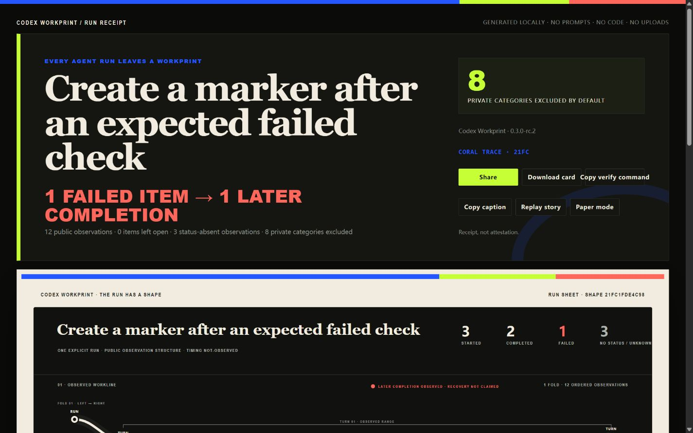 | 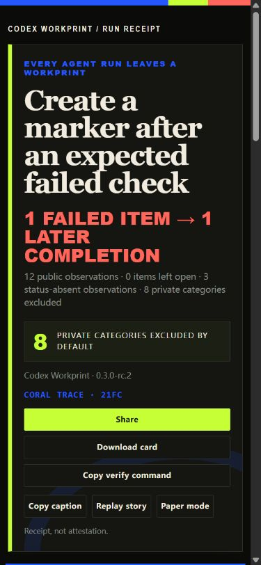 |
| Chinese Run Receipt | 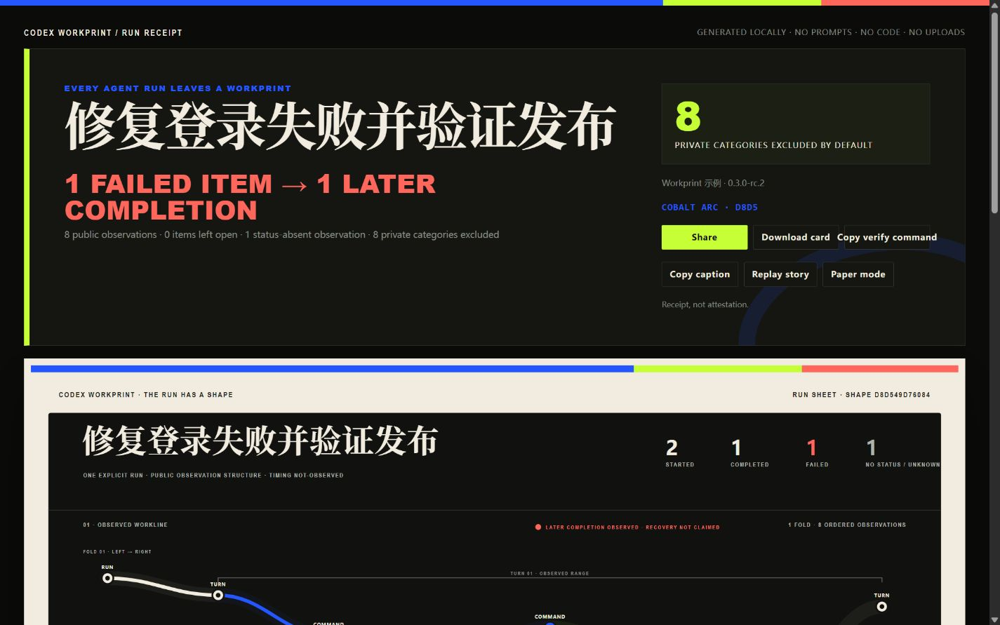 | 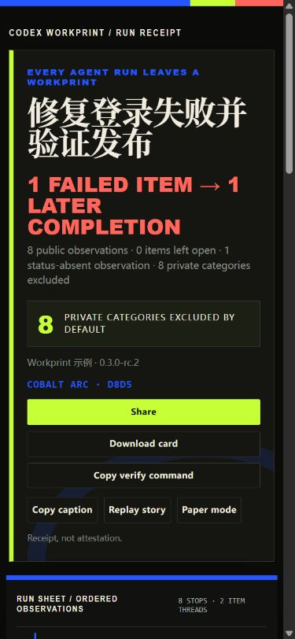 |
| Visible copy fallback | 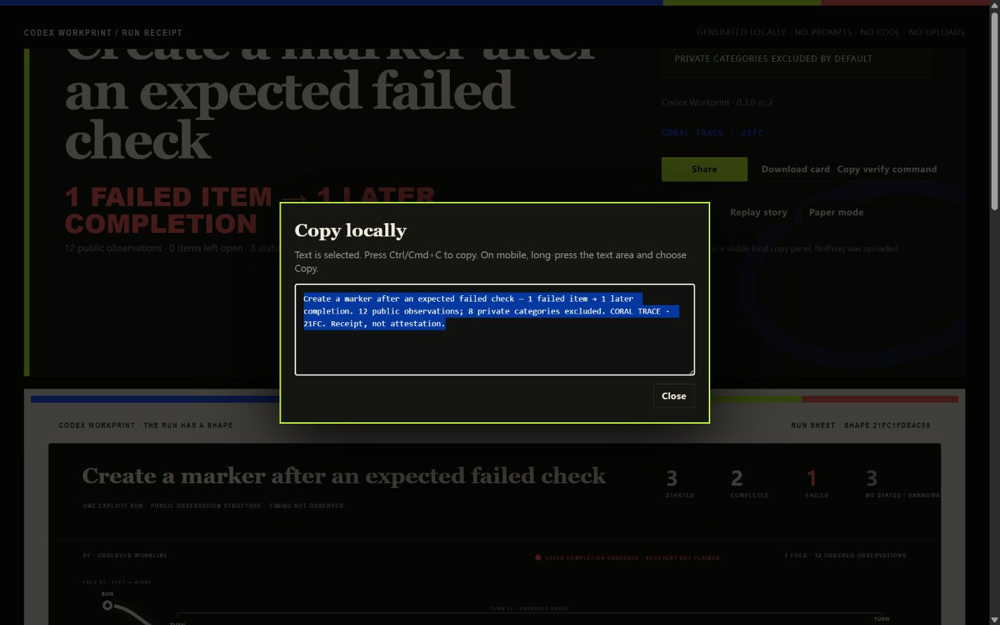 | 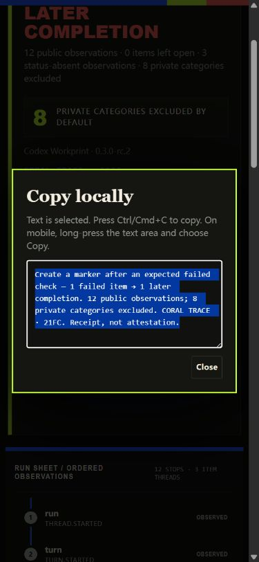 |

Observed aggregate:

- 2 artifacts, 4 viewport checks, and 6 screenshots;
- both narrow heroes close inside the requested 844px page viewport and hand off directly to a native vertical route;
- 0 horizontal-overflow failures and 0 visible-element outliers;
- 0 console warnings/errors, 0 remote asset URLs, and no page network API under `connect-src 'none'`;
- Share local-copy, exact Copy verify command clipboard readback, visible caption fallback, local Download event, theme round trip, station-by-station Replay, and failure-to-later-completion trace selection observed;
- fallback text was fully selected and its panel fit both desktop and narrow viewports;
- exact Chinese title visible in desktop and narrow DOM/screenshots, with no replacement character; both generated bitmap cards report complete visible-public-text glyph coverage, and the main `→` headline was visually reviewed without fallback `?`.

The primary narrow hero closes at y=824.23 and the 12-station route begins at y=842.23. The Chinese narrow hero closes at y=741.88 and its 8-station route begins at y=759.88. `scrollWidth === clientWidth` in every check. Copy source values are nonvisual; fallback uses the visible dialog instead of selecting an offscreen element.

The machine-readable authority is [`run-receipt-qa-receipt-2026-08-30-0.3.0-rc.2.json`](run-receipt-qa-receipt-2026-08-30-0.3.0-rc.2.json). The rc.1 receipt and four screenshots remain unchanged historical evidence. The resource inventory is browser-observable evidence, not a packet capture. This evidence is not physical-device, human-comprehension, source-authenticity, correctness, production, user, adoption, or market evidence.

## Historical 0.2.0-rc.1 Unified Profiles — 2026-08-30

All three generated `workprint-profile.html` artifacts were served from the loopback-only Profile QA server and exercised in the Codex In-app Browser on Windows. Each profile was checked at an explicitly requested 1440×900 desktop viewport and 390×844 narrow viewport. The screenshot API returned 1425×891 and 375×812 JPEG/JFIF page captures respectively; the machine receipt records both requested viewport and actual captured pixels.

| Profile | Desktop | Narrow |
| --- | --- | --- |
| Continuity / seam | 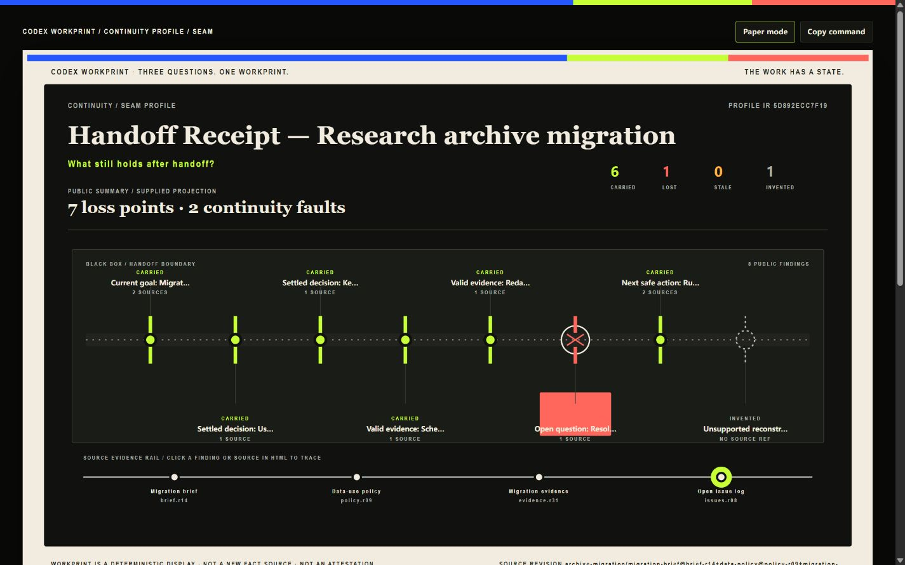 | 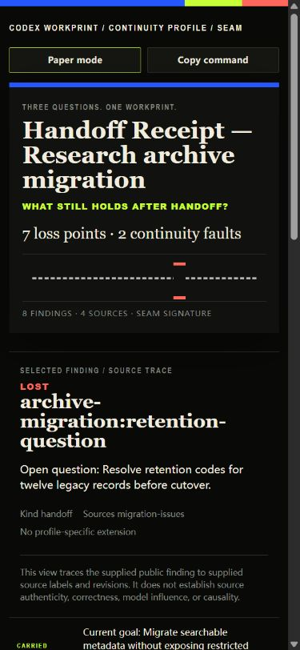 |
| Goal Delta / fault | 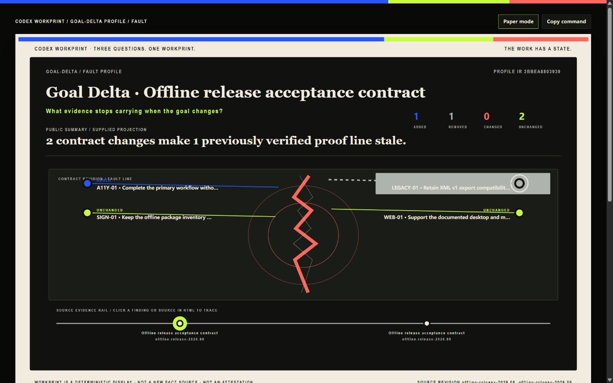 | 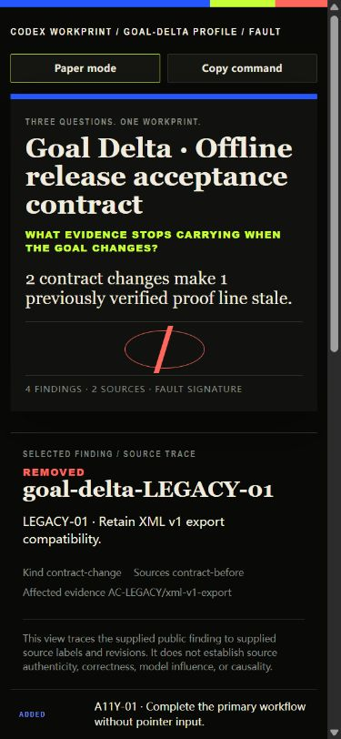 |
| Context Receipt / slice | 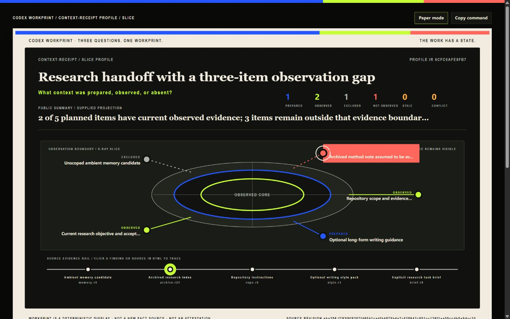 | 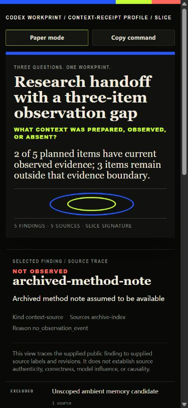 |

Observed aggregate:

- 3 profiles, 6 viewport checks, and 6 screenshots, all captured from `scrollY = 0` after a theme round trip restored carbon mode;
- 0 horizontal-overflow failures and 0 visible-element outliers at both widths;
- 0 console warnings/errors or observed page errors;
- 6 finding selections and 6 source selections, covering click and Enter activation with the trace type/id recorded after each action;
- desktop SVG visible/mobile hero hidden, and narrow mobile hero visible/desktop SVG hidden, for all three profiles;
- one inline SVG and zero external scripts, stylesheets, fonts, images, videos, other assets, or remote URLs per page;
- generated CSP includes `connect-src 'none'`, and source inspection exposes no network API. Page-assets inspection is not packet capture, so the receipt states that boundary.

The first narrow screen independently shows the task title, bounded profile question, supplied summary, the seam/fault/slice signature, and selected break/gap. The initial selected findings are the Continuity lost retention question, removed Goal Delta legacy contract, and Context Receipt not-observed archive note. Desktop renders the full evidence rail on the first screen.

The machine-readable authority is [`profile-qa-receipt-2026-08-30-0.2.0-rc.1.json`](profile-qa-receipt-2026-08-30-0.2.0-rc.1.json). The receipt binds current Profile IR, HTML, SVG, manifest, screenshot hashes, and actual screenshot dimensions. This remains Windows browser evidence over synthetic-scenario public projections—not physical-device, human-comprehension, source-authenticity, finding-correctness, model-influence, causality, user, or market evidence.

## Historical 0.1.0-rc.3 run — 2026-08-30

The final `demo/workprint.html` was served from an identity-checked loopback server (`X-Codex-Workprint-QA: 0.1.0-rc.3`) and exercised in the Codex In-app Browser on Windows. The runtime did not expose a browser engine version or raw network-event log, so the receipt states those limits instead of guessing.

### Desktop — actual page viewport 1440×900

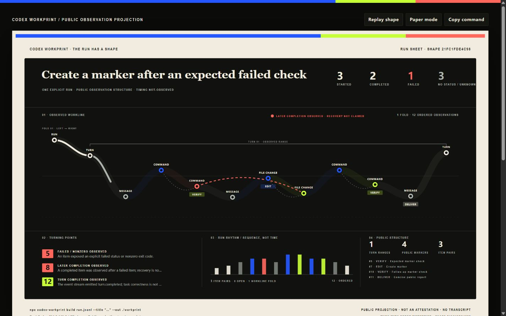

The first screen shows the public title, Shape ID, 3 started / 2 completed / 1 failed / 3 no-status observations, post-failure relation, full Run Sheet layers, and Replay/theme/copy controls. The complete white artifact extends 25px below the 900px viewport, while the Workline, turning points, rhythm, and public-structure panels are visible. Initial detail is observation 5 (`item.completed`, `command_execution`, explicit `failed`, exit `1`). Title/metrics and Workline headers do not overlap; horizontal overflow is false.

Actual interactions observed:

- Replay clicked and advanced station by station: the mid-sample selected observation 4 and the final sample selected observation 12. Enter activation was separately observed after the accessibility fix.
- Paper mode opened and carbon mode restored.
- Normal Copy resolved the page Clipboard path and displayed `Copied`; the separate browser clipboard interface returned an empty string, so the receipt does not claim independent byte readback. Shift+click selected the exact public build command through the fallback path.
- Observation 8 showed `file_change`, `completed`, and only “completion observed after a failed item.”

The screenshot API returned 1425×891 JPEG/JFIF bytes despite the requested page viewport; the `.jpg` extension matches magic bytes.

### Narrow — actual page viewport 390×844

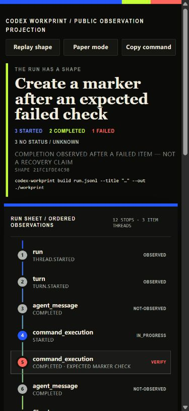

The masthead lays out three controls without horizontal overflow. The mobile lead keeps the title, counts, claim boundary, Shape ID, and complete `--title` generation command readable. A native 12-station vertical route is visible and the desktop SVG is hidden rather than shrunken. `documentElement.scrollWidth` was 375, overflow was false, and the visible-element outlier count was 0. Click Replay, Enter Replay, and observation 8 selection all completed.

The screenshot API returned 375×812 JPEG/JFIF bytes; the receipt binds its exact hash and dimensions.

### Console, assets, PNG, and boundary

- Final desktop and narrow console warnings/errors: `0` / `0`.
- Browser `pageAssets`: one inline SVG; zero external scripts, fonts, images, stylesheets, videos, other assets, or remote URLs.
- The available resource/CSP/source surface observed zero remote requests. This is not a packet capture; the runtime did not expose a raw network-event log.
- Product `demo/share-card.png`: real PNG magic, exactly 1200×630, renderer v3, independently hashed.
- Reduced-motion CSS/runtime branches are test-covered; this browser run used `no-preference` and did not emulate `reduce`.

The machine-readable authority is [`qa-receipt-2026-08-30-rc3.json`](qa-receipt-2026-08-30-rc3.json). This evidence is browser-only: it is not human-comprehension, physical-macOS, authenticity, correctness, user, or market evidence.

## Historical rc.2 and rc.1 runs

The unsuffixed 2026-08-30 receipt/screenshots remain unchanged as rc.2 history. The rc.1 receipt and screenshots also remain unchanged:

- [`qa-receipt-2026-08-29.json`](qa-receipt-2026-08-29.json)
- [`workprint-desktop-viewport-1440x900.jpg`](workprint-desktop-viewport-1440x900.jpg)
- [`workprint-narrow-viewport-390x844.jpg`](workprint-narrow-viewport-390x844.jpg)

Those historical hashes bind their dated candidate bytes, not the current demo.
